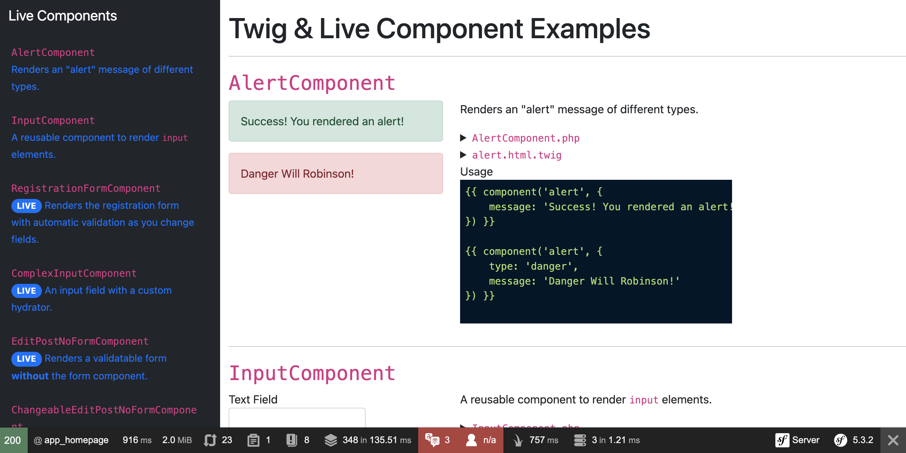

# Twig & Live Components Demo

Hi there! You've stumbled across a treasure of demos for the
the [TwigComponent](https://github.com/symfony/ux-twig-component)
abd [LiveComponent](https://github.com/symfony/ux-live-component)
libraries! Fun!

If you want to see how this system works - including watching forms
automatically validate themselves as you type... with zero custom
JavaScript, it's all waiting for you here.



## Setup

Let's get going!

```
git clone git@github.com:weaverryan/live-demo.git
cd live-demo

composer install
yarn install --force
yarn watch
```

Prep the SQLite database:

```
php bin/console doctrine:schema:create
php bin/console doctrine:fixtures:load
```

Then start the built-in web server:

```
symfony serve -d
symfony open:local
```

Have fun!

If you have ideas or find a problem, you can open an issue on
https://github.com/symfony/ux
